# lshash Architecture

This document describes the technical architecture of both implementations:

- Bash implementation: `lshash.sh`
- .NET implementation: `dotnet/Program.cs`

It also covers parity testing in `tests/regression.sh`.

## 1. System overview

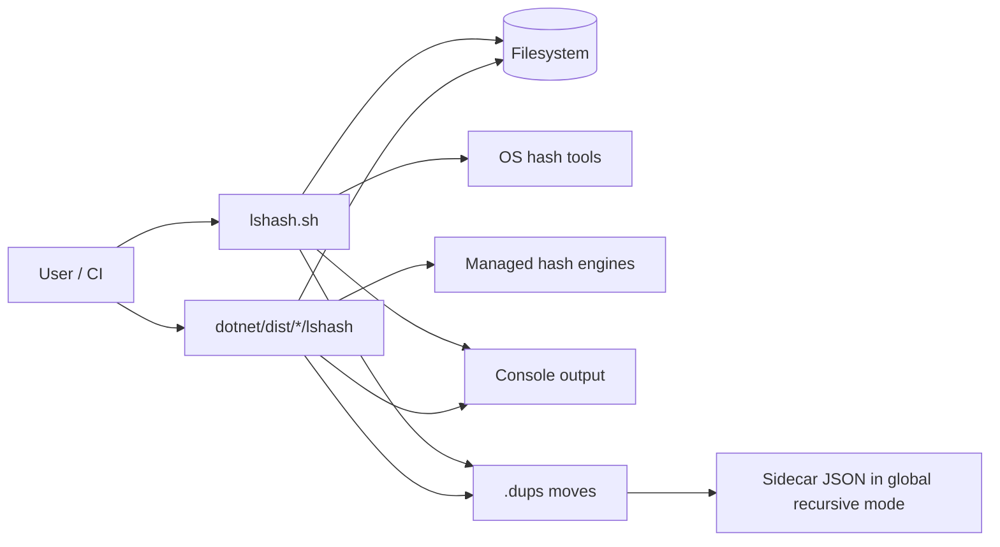

## 2. Shared behavioral contract

Both implementations follow the same behavior contract, validated by parity tests.

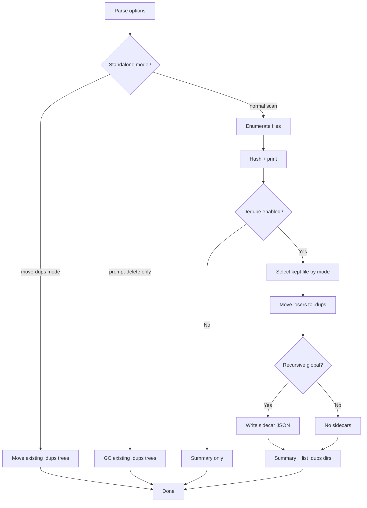

## 3. Option parsing architecture

### 3.1 Bash parser

`lshash.sh` parses long options and short-option clusters (`-rd`, `-rq`, `-re`).

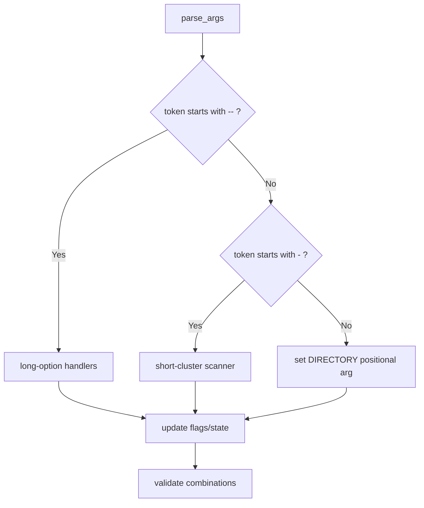

### 3.2 .NET parser

`dotnet/Program.cs` parses similarly, including short cluster decoding and mode validation.

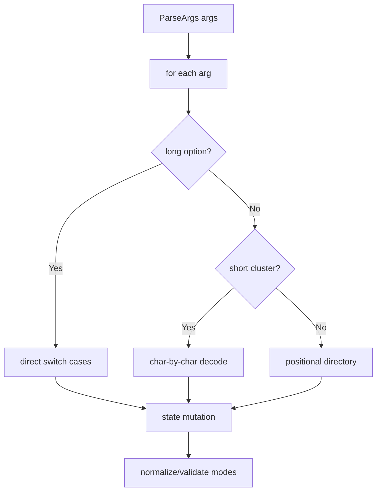

## 4. File traversal architecture

## 4.1 Recursive traversal

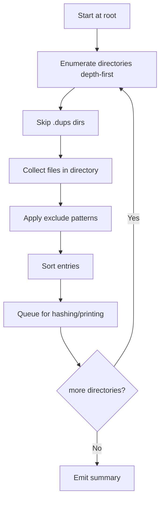

## 4.2 Dedupe scope selection

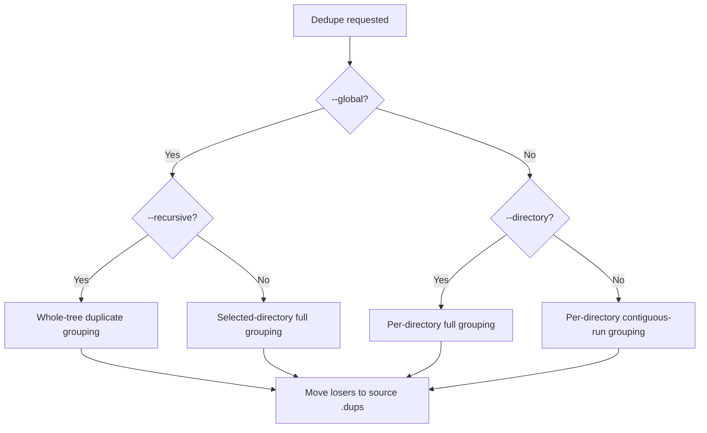

## 5. Dedupe decision engine

The keep-selection strategy is shared:

- `newer`: keep greatest mtime
- `older`: keep smallest mtime
- `shorter`: keep shortest root-relative path length
- `longer`: keep longest root-relative path length

```mermaid
flowchart TD
  A[Duplicate set] --> B[Initial keep = first item]
  B --> C[Compare candidate vs keep]
  C --> D{Mode}
  D -->|newer| E[candidate.mtime > keep.mtime]
  D -->|older| F[candidate.mtime < keep.mtime]
  D -->|shorter| G[len(candidate.relativePath) < len(keep.relativePath)]
  D -->|longer| H[len(candidate.relativePath) > len(keep.relativePath)]
  E --> I[maybe replace keep]
  F --> I
  G --> I
  H --> I
  I --> J{more candidates?}
  J -->|Yes| C
  J -->|No| K[Move non-kept entries]
```

## 6. Bash implementation internals

### 6.1 Processing pipeline

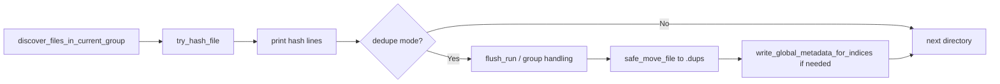

### 6.2 External dependency model

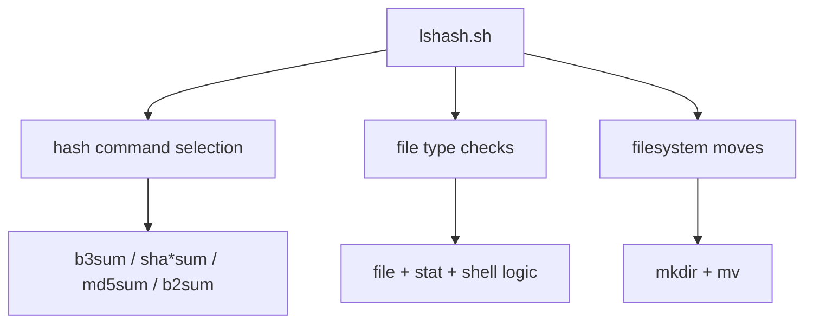

## 7. .NET implementation internals

## 7.1 Main execution flow

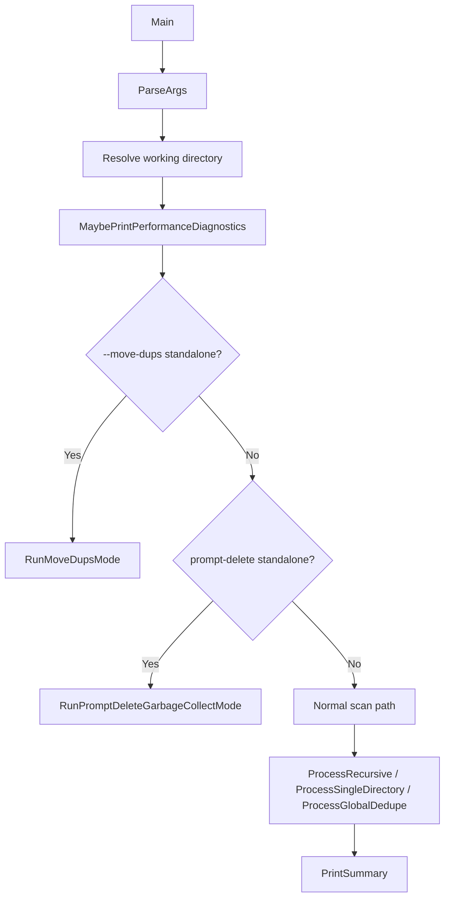

## 7.2 Hashing subsystem

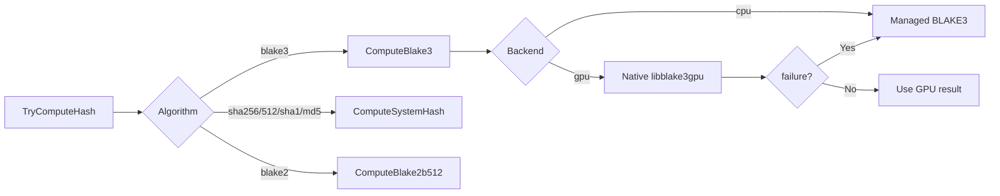

## 7.3 Adaptive parallel hashing controller

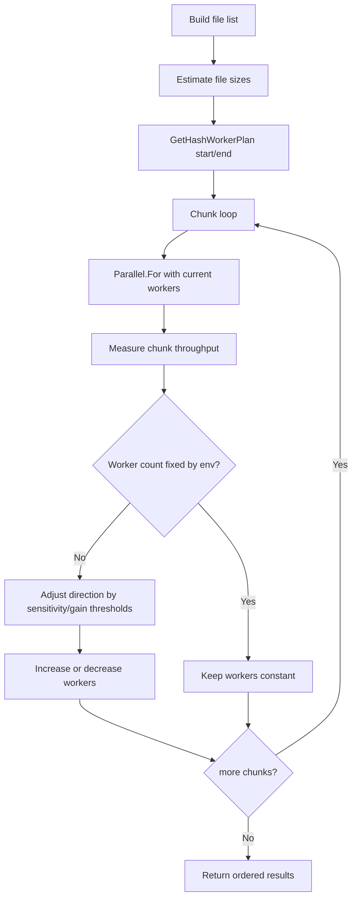

## 8. Metadata sidecar architecture (`-r -d --global`)

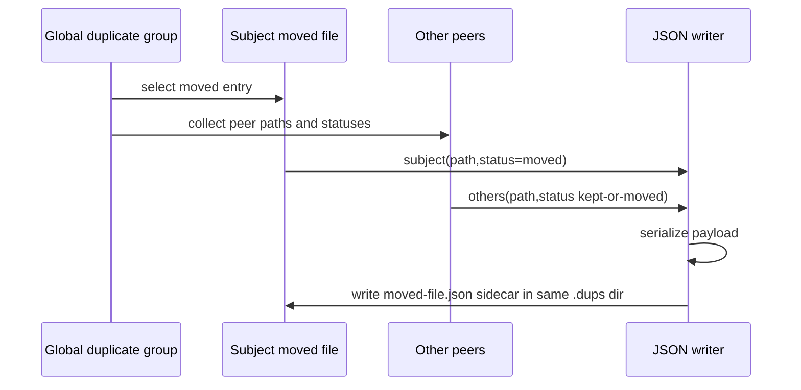

## 9. Standalone maintenance modes

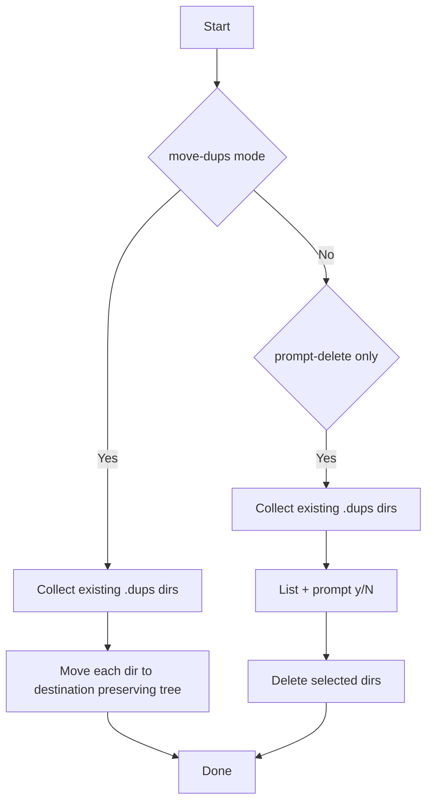

## 10. Parity and regression architecture

Parity tests drive both implementations with equivalent fixtures and compare normalized outputs.

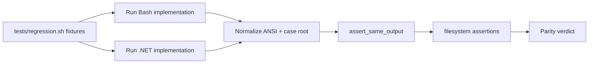

## 11. Key design choices

- Keep behaviorally identical user contract across Bash and .NET.
- Preserve deterministic output ordering even with .NET parallel hashing.
- Separate audit and mutation phases for safer operations.
- Keep maintenance modes (`--prompt-delete`, `--move-dups`) explicitly standalone.
- Surface diagnostics for network filesystems where tuning visibility is critical.

## 12. Appendix: Advantages of BLAKE3

BLAKE3 is a modern cryptographic hash function and a strong default for file hashing workflows.

- High speed: significantly faster than older hashes (such as SHA-256) on many systems, which helps when scanning large directories.
- Efficient scaling: designed to use parallelism well, so it performs especially well on modern multi-core CPUs.
- Strong security design: built from well-reviewed cryptographic components and intended for robust integrity checking.
- Flexible output: supports extendable output mode (XOF), which allows generating more output bytes when needed for advanced uses.
- Practical tooling: available via `b3sum`, making it easy to integrate into scripts and command-line workflows.

For this project, BLAKE3 provides a good balance of speed and safety for differentiating files by content hash.

### Quick comparison

| Algorithm | Speed (typical) | Collision resistance for modern use | Security posture                              | Best fit in this project                                                 |
| --------- | --------------- | ----------------------------------- | --------------------------------------------- | ------------------------------------------------------------------------ |
| BLAKE3    | Very high       | Strong                              | Modern cryptographic design                   | Default choice for fast, reliable file differentiation                   |
| SHA-256   | Moderate        | Strong                              | Widely standardized and trusted               | Great compatibility fallback when BLAKE3 is unavailable                  |
| MD5       | Very high       | Weak                                | Not suitable for adversarial integrity checks | Non-security workflows where speed matters and collisions are acceptable |
