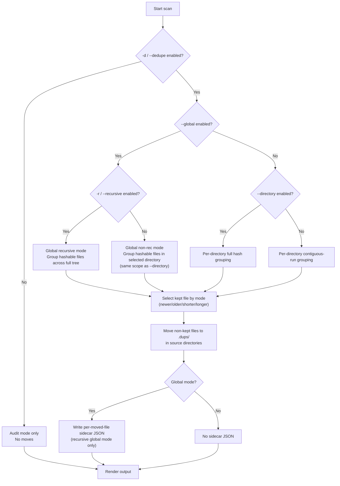
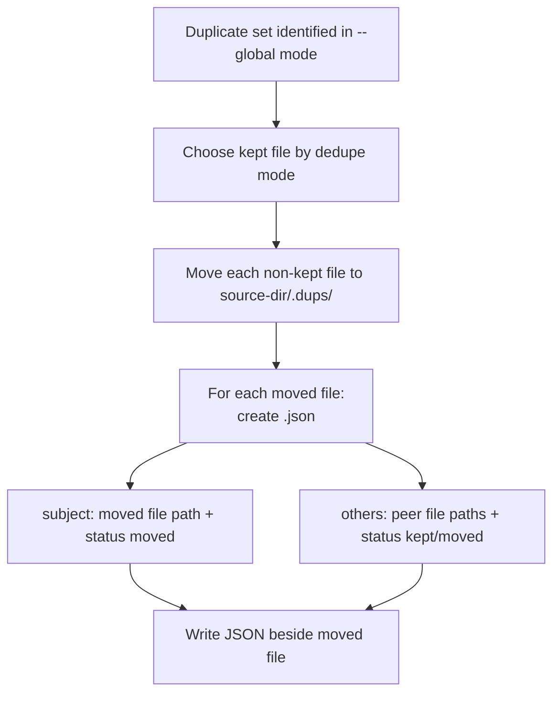

# lshash

A corpus-hygiene utility for RAG data pipelines that identifies duplicate content risk, quantifies duplication with actionable statistics, and supports controlled remediation before indexing. It enables staged audit-then-cull workflows that improve retrieval quality, reduce embedding/indexing cost, and strengthen governance in knowledge curation operations.

Topic tags: rag, retrieval-augmented-generation, data-curation, data-governance, corpus-hygiene, document-deduplication, file-deduplication, knowledge-management, data-quality, bash, dotnet

## Features

- Sorts files alphabetically.
- Aligns the hash column based on the longest displayed file name.
- Supports multiple hash algorithms.
- Defaults to BLAKE3.
- Can recurse into subdirectories.
- Supports multiple exclusion patterns.
- Ignores `.dups/` directories by default.
- In recursive mode, processes and prints results directory-by-directory as traversal encounters them.
- Continues processing on per-file access errors and emits warnings instead of halting.
- Highlights adjacent matching hashes in green.
- Optional dedupe mode to keep one file and move duplicates into hidden `.dups/` directories.
- Prints a completion summary with duplicate counts and percentages.
- Supports macOS Catalina-compatible traversal behavior (no GNU `find -printf` / `sort -z` dependency).

## Upfront use-case perspective

This tool was developed as a corpus-hygiene control for RAG pipelines.

In production RAG systems, duplicate files can create duplicate chunks, increase embedding/indexing spend, and over-weight repeated content during retrieval. That can reduce answer quality and make retrieval behavior less predictable.

The intended workflow is a staged curation process:

- Phase 1 (audit, no mutation): run without `-d` to profile duplication as part of pre-ingestion assessment. Use the completion statistics to quantify duplicate-file rate before chunking and embedding.
- Phase 2 (remediation, optional): run with `-d` (and optionally `--directory` for full-directory grouping) to quarantine duplicates into `.dups/`, reducing corpus redundancy before indexing.
- Phase 3 (post-curation validation): re-run audit and compare summary metrics to confirm that curation improved corpus quality.

This separation of discovery and action supports safer change control, clearer governance, and repeatable RAG data-preparation practice.

## Script

- `lshash.sh`

## Implementations

- Bash implementation:
  - Script: `lshash.sh`
  - Supports contiguous dedupe and `--directory` dedupe (with `--all-directory` as a compatibility alias)
- .NET implementation:
  - Project: `dotnet/`
  - Supports the same runtime options and dedupe variants as Bash

## Requirements

- Bash 3.2+
- Standard Unix tools: `find`, `sort`, `awk`, `stat`, `mv`
- Hash command for selected algorithm:
  - `b3sum` for `blake3`
  - `sha256sum` for `sha256`
  - `sha512sum` for `sha512`
  - `sha1sum` for `sha1`
  - `md5sum` for `md5`
  - `b2sum` for `blake2`

### macOS note

- The script now runs on macOS Catalina or later shell/tooling for traversal and sorting behavior.
- Hash command requirements still apply by algorithm choice. On macOS, `blake3` is typically the easiest path because `b3sum` can be auto-installed when package tooling is available.

### BLAKE3 auto-install behavior

If `blake3` is selected and `b3sum` is missing, the script attempts an automatic install using a detected package manager.

- Uses non-interactive elevation (`sudo -n`) when needed.
- Uses a timeout for install attempts.
- Timeout defaults to 20 seconds and can be overridden:

```bash
LSHASH_INSTALL_TIMEOUT=10 ./lshash.sh
```

If installation cannot be done automatically, the script exits with guidance.

## .NET 10 implementation

This repository also includes a .NET 10 C# implementation with behavior parity to the Bash script.

### Build a self-contained single-file executable

```bash
cd dotnet
./build.sh
```

Optional runtime identifier argument:

```bash
cd dotnet
./build.sh linux-x64
```

Output executable:

- `dotnet/dist/linux-x64/lshash`

The publish configuration is self-contained and single-file, so no .NET runtime is required on the target host.
The .NET build also enables invariant globalization, so `libicu` is not required on minimal Linux containers.

### Build native macOS self-contained binaries

```bash
cd dotnet
./build-macos.sh
```

Optional target selection:

```bash
cd dotnet
./build-macos.sh osx-arm64
./build-macos.sh osx-x64
```

Output executables:

- `dotnet/dist/osx-arm64/lshash`
- `dotnet/dist/osx-x64/lshash`

### macOS deployment for .NET implementation

Native .NET 10 self-contained binaries may fail on Catalina or earlier due to runtime/OS compatibility.

Use the Docker deployment bundle instead:

```bash
cd dotnet/deploy/macos
./deploy.sh build
./deploy.sh audit /path/to/scan
./deploy.sh cull /path/to/scan
```

The deployment wrapper is documented in `dotnet/deploy/macos/README.md`.

### Run from source

```bash
cd dotnet
dotnet run -c Release -- --help
```

### .NET options

The .NET implementation supports the same options as Bash (`--algorithm`, `-r/--recursive`, `-e/--exclude`, `-d/--dedupe`, `--directory` (alias `--all-directory`), `--global`, `--prompt-delete`, `-q/--quiet`, optional `DIRECTORY`):

- `--directory` (alias: `--all-directory`)
  - With `-d/--dedupe`, dedupe by hash across all files in each directory, ignoring filename adjacency
  - Without `-d/--dedupe`, this flag is a no-op
- `--global`
  - With `-d/--dedupe` and `-r/--recursive`, dedupe by hash across the entire recursive tree
  - With `-d/--dedupe` without `-r/--recursive`, behaves like `--directory` on the selected directory
  - Sidecar metadata files `<moved-file>.json` are created only in recursive global mode (`-r -d --global`)
  - Without `-d/--dedupe`, this flag is a no-op
- `--prompt-delete`
  - With `-d/--dedupe`, after listing `.dups` directories, prompts `y/N` to delete them
  - Used alone (or with only `DIRECTORY`), recursively gathers existing `.dups` directories, lists them, and prompts `y/N` to delete them
  - When combined with other non-dedupe options, this flag is a no-op

### .NET BLAKE3 backend selection

- Default backend is GPU via `vendor/libblake3gpu.so`.
- Override backend with environment variable `LSHASH_BLAKE3_BACKEND`:
  - `gpu` (default)
  - `cpu`
- If GPU backend initialization or hashing fails at runtime, the process falls back to CPU BLAKE3 for the remainder of that run.
- Optional GPU chunk budget override:
  - `LSHASH_BLAKE3_GPU_MAX_CHUNKS` (positive integer)
  - Default: `1048576` (`1 << 20`)

### .NET examples

```bash
dotnet/dist/linux-x64/lshash -q
dotnet/dist/linux-x64/lshash -rq /path/to/scan
dotnet/dist/linux-x64/lshash -r -d shorter -q
dotnet/dist/linux-x64/lshash --directory                # no-op without -d
dotnet/dist/linux-x64/lshash -d shorter --directory
dotnet/dist/linux-x64/lshash -d shorter --global
dotnet/dist/linux-x64/lshash -r -d shorter --global
dotnet/dist/linux-x64/lshash -d shorter --prompt-delete
dotnet/dist/linux-x64/lshash --prompt-delete
dotnet/dist/linux-x64/lshash --prompt-delete /path/to/scan
```

## Usage

```bash
./lshash.sh [--algorithm NAME] [-r|--recursive] [-e PATTERN] [--exclude PATTERN] [-d [MODE]] [--directory] [--global] [--prompt-delete] [-q|--quiet] [DIRECTORY]
```

## macOS execution quick guide

### Bash implementation (native, including Catalina)

```bash
cd /path/to/lshash
chmod +x ./lshash.sh
./lshash.sh --algorithm sha256 -r /path/to/scan
```

### .NET implementation on modern macOS (native)

```bash
cd dotnet
./build-macos.sh
./dist/osx-arm64/lshash --help   # Apple Silicon
./dist/osx-x64/lshash --help     # Intel
```

### .NET implementation on macOS Catalina (Docker Desktop)

```bash
cd dotnet/deploy/macos
./deploy.sh build
./deploy.sh audit /path/to/scan
./deploy.sh cull /path/to/scan
```

## Options

- `--algorithm NAME`
  - Hash algorithm: `blake3`, `sha256`, `sha512`, `sha1`, `md5`, `blake2`
- `-r`, `--recursive`
  - Include files in subdirectories
  - Hidden `.dups/` directories are skipped by default
  - Output is emitted progressively per directory encountered during traversal
- `-e PATTERN`
- `--exclude PATTERN`
- `--exclude=PATTERN`
  - Exclude files matching glob pattern (repeatable)
- `-d [MODE]`, `--dedupe [MODE]`, `--dedup [MODE]`
- `-d=MODE`, `--dedupe=MODE`, `--dedup=MODE`
  - Dedupe files with identical hash in the same directory
  - Valid `MODE` values: `newer`, `older`, `shorter`, `longer`
  - Default mode when omitted: `shorter`
- `--directory` (alias: `--all-directory`)
  - With `-d/--dedupe`, uses full-directory hash grouping instead of contiguous-neighbor grouping
  - Without `-d/--dedupe`, no-op
- `--global`
  - With `-d/--dedupe` and `-r/--recursive`, dedupes by hash across all scanned files in the recursive tree (not per-directory)
  - With `-d/--dedupe` without `-r/--recursive`, behaves like `--directory` for the selected directory
  - In recursive global mode (`-r -d --global`), each moved duplicate gets a sidecar metadata JSON file `<moved-file>.json` in `.dups/` describing duplicate peers (full paths) and statuses (`kept`/`moved`)
  - Without `-d/--dedupe`, no-op
- `--prompt-delete`
  - With `-d/--dedupe`, after printing `.dups` directory paths, prompts `y/N` to delete them
  - Used alone (or with only `DIRECTORY`), recursively gathers existing `.dups` directories, lists them, and prompts `y/N` to delete them
  - When combined with other non-dedupe options, no-op
- `-q`, `--quiet`
  - Only print duplicate lines (the lines that would be highlighted green in normal output)
  - Works with and without dedupe, and with and without recursive mode
- `DIRECTORY` (optional positional argument)
  - Scan this directory instead of the current working directory
  - Output paths remain relative to the selected directory root
- One-letter short switches are stackable in any order (for example `-rd`, `-dr`, `-rq`, `-re '*.log'`).

## Output formatting

- Hash values are left-justified in a single aligned column.
- If the previous listed file has the same hash, the current hash is shown in green.
- When dedupe moves a file, the file name is italicized and annotated:
  - `(moved to .dups/)`
- Completion summary reports duplicate count and percentage of scanned files.
- With `-r/--recursive`, summary also reports directories traversed.
- With `-d/--dedupe`, summary wording changes to duplicates "found and moved".

## Dedupe behavior

When dedupe is enabled:

- Primary use case: remove copy/restore/merge artifacts where duplicate files usually sort next to each other (for example names containing `(copy)`, version suffixes, or sync-conflict tags).
- Duplicate groups are determined by contiguous same-hash blocks in alphabetical listing order within each directory.
- Files that cannot be hashed are skipped for block matching, so they do not break a contiguous duplicate block among hashable neighbors.
- Genuine executable program files are excluded from dedupe matching and never moved (requires execute permission plus program/script detection, for example MIME types such as `application/x-pie-executable` or `text/x-shellscript`; shebang scripts are also treated as executable programs even if MIME resolves to `text/plain`; many file managers show these as `Program`).
- One file is kept in place based on selected mode.
- All other duplicates in that directory are moved to that directory's `.dups/` subdirectory.
- In recursive mode, dedupe is still per directory encountered during traversal.
- Tie-breaking rule: first file in sorted listing order is kept.
- If a destination name already exists in `.dups/`, a `.dupN` suffix is added.
- `--directory` provides a more thorough filename-blind mode that checks duplicates across the full directory. It only takes effect when used with `-d/--dedupe`.
- `--global` extends dedupe scope across the full recursive tree when combined with `-d` and `-r`, and writes provenance JSON sidecars (`<moved-file>.json`) for moved files.

### Dedupe scope matrix

| Flags | Duplicate scope | Grouping method | Moved file destination | Sidecar metadata |
| --- | --- | --- | --- | --- |
| `-d` | Per directory | Contiguous same-hash runs in sorted filename order | Same directory `.dups/` | No |
| `-d --directory` | Per directory | Full-directory hash grouping (filename adjacency ignored) | Same directory `.dups/` | No |
| `-d --global` | Selected directory only | Full-directory hash grouping (same as `--directory`) | Same directory `.dups/` | No |
| `-d -r --global` | Full recursive tree | Whole-tree hash grouping across directories | Each file's own source directory `.dups/` | Yes (`.json`) |

### Global mode metadata (`<moved-file>.json`)

In recursive `--global` mode (`-r -d --global`), every moved duplicate gets a sidecar metadata file next to it in `.dups/`:

- Name: `<moved-file>.json`
- Location: same `.dups/` directory as the moved file
- Purpose: explain the duplicate set peers and which file was kept vs moved

JSON structure:

```json
{
  "hash": "<hash>",
  "dedupeMode": "shorter",
  "subject": {
    "path": "/abs/path/to/dir/.dups/file.ext",
    "status": "moved"
  },
  "others": [
    {
      "path": "/abs/path/to/kept/file.ext",
      "status": "kept"
    },
    {
      "path": "/abs/path/to/another/dir/.dups/file2.ext",
      "status": "moved"
    }
  ]
}
```

## Dedupe flow diagrams

### Scope and strategy selection



### Global sidecar generation lifecycle



### Strategy summary

- Default (`-d`): optimized for copy/restore/merge artifacts where duplicate names are often alphabetically adjacent.
- `--directory` with `-d`: more thorough and filename-blind dedupe across the entire directory.
- `--directory` without `-d`: no-op (normal non-dedupe listing behavior).
- `--global` with `-d -r`: cross-directory, whole-tree hash dedupe with per-moved-file metadata JSON.
- `--global` with `-d` (no `-r`): equivalent dedupe scope to `--directory` on the selected directory and does not emit sidecar JSON.

## Examples

### Basic listing (default BLAKE3)

```bash
./lshash.sh
```

### Use SHA-256

```bash
./lshash.sh --algorithm sha256
```

### Recursive listing

```bash
./lshash.sh -r
```

### Exclude multiple patterns

```bash
./lshash.sh -r -e '*.log' --exclude '*.tmp' --exclude='build/*'
```

### Dedupe with default mode (`shorter`)

```bash
./lshash.sh -d
```

### Dedupe and keep newest file

```bash
./lshash.sh -r --dedupe newer
```

### Dedupe and keep longest file name

```bash
./lshash.sh --dedupe=longer
```

### Global dedupe in one directory (non-recursive)

```bash
./lshash.sh -d shorter --global /path/to/scan
```

This uses full-directory hash grouping for that single directory (same scope behavior as `--directory`) and does not write sidecar metadata.

### Global dedupe across full recursive tree

```bash
./lshash.sh -r -d shorter --global /path/to/scan
```

This compares hashable files across all directories in the tree, moves losers to each file's local `.dups/`, and writes `<moved-file>.json` sidecars.

### Global dedupe with a different keep policy

```bash
./lshash.sh -r --dedupe newer --global /path/to/scan
```

In each duplicate set, the newest file is kept in place and all others are moved to their source-directory `.dups/` folders.

### Inspect generated sidecar metadata

```bash
find /path/to/scan -path '*/.dups/*.json' -maxdepth 6 -print
cat /path/to/scan/some/dir/.dups/example.txt.json
```

If `jq` is available:

```bash
jq . /path/to/scan/some/dir/.dups/example.txt.json
```

### Only show duplicate lines

```bash
./lshash.sh -q
./lshash.sh -rq /path/to/scan
```

### Prompt-delete garbage collection mode

```bash
./lshash.sh --prompt-delete
./lshash.sh --prompt-delete /path/to/scan
```

### Summary message examples (hypothetical)

These examples use made-up file sets to show how the completion summary text changes by mode.

#### 1. Audit pass (no `-d`): duplicates found

Hypothetical files in one directory:

```text
a.txt         (content: same)
b.txt         (content: same)
c.txt         (content: different)
```

Command:

```bash
./lshash.sh --algorithm sha256
```

Expected output shape:

```text
a.txt  <hash-A>
b.txt  <hash-A>
c.txt  <hash-C>
Summary: scanned 3 file(s); 1 duplicate file(s) were found (33.33% of scanned files).
```

#### 2. Recursive audit (`-r`, no `-d`): adds traversed directories

Hypothetical tree:

```text
./a.txt             (content: same)
./b.txt             (content: same)
./sub/c.txt         (content: unique)
```

Command:

```bash
./lshash.sh --algorithm sha256 -r
```

Expected output shape:

```text
a.txt      <hash-A>
b.txt      <hash-A>
sub/c.txt  <hash-C>
Summary: scanned 3 file(s); 1 duplicate file(s) were found (33.33% of scanned files); 2 directories were traversed.
```

#### 3. Cull pass (`-d`): duplicates found and moved

Hypothetical files in one directory:

```text
a.txt         (content: same)
aa.txt        (content: same)
aaa.txt       (content: same)
```

Command:

```bash
./lshash.sh --algorithm sha256 -d shorter
```

Expected output shape:

```text
a.txt                         <hash-A>
aa.txt (moved to .dups/)      <hash-A>
aaa.txt (moved to .dups/)     <hash-A>
Summary: scanned 3 file(s); 2 duplicate file(s) were found and moved (66.66% of scanned files).
```

Expected result on disk:

```text
.dups/aa.txt
.dups/aaa.txt
```

#### 4. Audit pass with no duplicates: zero percentage

Hypothetical files in one directory:

```text
a.txt         (content: alpha)
b.txt         (content: bravo)
c.txt         (content: charlie)
```

Command:

```bash
./lshash.sh --algorithm sha256
```

Expected output shape:

```text
a.txt  <hash-A>
b.txt  <hash-B>
c.txt  <hash-C>
Summary: scanned 3 file(s); 0 duplicate file(s) were found (0.00% of scanned files).
```

#### 5. Recursive cull (`-r -d`): moved count plus traversed directories

Hypothetical tree:

```text
./a.txt            (content: same)
./aa.txt           (content: same)
./sub/p.txt        (content: same)
./sub/pp.txt       (content: same)
```

Command:

```bash
./lshash.sh --algorithm sha256 -r -d shorter
```

Expected output shape:

```text
a.txt                         <hash-A>
aa.txt (moved to .dups/)      <hash-A>
sub/p.txt                     <hash-P>
sub/pp.txt (moved to .dups/)  <hash-P>
Summary: scanned 4 file(s); 2 duplicate file(s) were found and moved (50.00% of scanned files); 2 directories were traversed.
```

#### 6. `--directory` without `-d`: modifier no-op

Hypothetical files in one directory (non-adjacent duplicate content):

```text
a-copy.txt         (content: same)
m-middle.txt       (content: unique)
z-sync.txt         (content: same)
```

Command:

```bash
./lshash.sh --algorithm sha256 --directory
```

Expected output shape:

```text
a-copy.txt  <hash-S>
m-middle.txt  <hash-M>
z-sync.txt  <hash-S>
Summary: scanned 3 file(s); 0 duplicate file(s) were found (0.00% of scanned files).
```

#### 7. `--directory` with `-d`: non-adjacent duplicates moved

Use the same hypothetical files as example 6.

Command:

```bash
./lshash.sh --algorithm sha256 -d shorter --directory
```

Expected output shape:

```text
a-copy.txt                      <hash-S>
m-middle.txt                    <hash-M>
z-sync.txt (moved to .dups/)    <hash-S>
Summary: scanned 3 file(s); 1 duplicate file(s) were found and moved (33.33% of scanned files).
```

#### 8. Quiet mode (`-q`) still prints summary

Hypothetical files in one directory:

```text
a.txt         (content: same)
b.txt         (content: same)
c.txt         (content: unique)
```

Command:

```bash
./lshash.sh --algorithm sha256 -q
```

Expected output shape:

```text
b.txt  <hash-A>
Summary: scanned 3 file(s); 1 duplicate file(s) were found (33.33% of scanned files).
```

## Notes

- Dedupe moves files; it does not delete them.
- Review output carefully before running dedupe on important directories.

## Troubleshooting

### Default run seems slow or pauses

- First run with `blake3` may try to auto-install `b3sum` if missing.
- Use another algorithm immediately:

```bash
./lshash.sh --algorithm sha256
```

- Reduce install wait time:

```bash
LSHASH_INSTALL_TIMEOUT=5 ./lshash.sh
```

### `b3sum` not found

- Install it manually, or use another algorithm.
- Example fallback:

```bash
./lshash.sh --algorithm sha512
```

### Permission or file access errors

- If a file cannot be read (for hash or metadata), the tool prints a warning and continues.
- Output for those files shows `<hash unavailable>`.
- In dedupe mode, inaccessible files are ignored for contiguous block matching; hashable neighbors can still form a duplicate block across them.

### Permission issues during auto-install

- Auto-install uses non-interactive sudo (`sudo -n`) and will fail fast if credentials are not already available.
- Fix by installing `b3sum` manually or run with a different algorithm.

### Dedupe did not move files as expected

- Dedupe only groups contiguous same-hash neighbors (in alphabetical listing order) within the same directory.
- With `-r`, grouping is still per directory, not across the entire tree.
- For cross-directory dedupe across the full tree, use `-r -d --global`.
- Confirm mode selection:
  - `newer` keeps newest
  - `older` keeps oldest
  - `shorter` keeps shortest file name (default)
  - `longer` keeps longest file name

### Quiet mode printed nothing

- `-q/--quiet` only prints duplicate lines (green lines in normal mode).
- If no adjacent duplicate hashes are encountered in listing order, quiet output will be empty.

### Unexpected shell warnings about current directory

- If your shell says it cannot access the current directory (`getcwd` warnings), your working directory may have been deleted.
- Change into a valid directory before running again:

```bash
cd /home/npepin/Projects/lshash
```

## FAQ

### How do I run a simple hash listing in the current directory?

```bash
./lshash.sh
```

### How do I scan a different directory?

```bash
./lshash.sh /path/to/scan
./lshash.sh -rq /path/to/scan
```

### How do I recurse but skip common noise directories and file types?

```bash
./lshash.sh -r -e '.git/*' -e '.dups/*' -e 'node_modules/*' -e '*.log' -e '*.tmp'
```

### How do I use a non-BLAKE3 algorithm quickly?

```bash
./lshash.sh --algorithm sha256
```

### How do I dedupe recursively and keep the newest file in each duplicate set?

```bash
./lshash.sh -r --dedupe newer
```

### How do I dedupe across the entire recursive tree (not per-directory)?

```bash
./lshash.sh -r -d shorter --global /path/to/scan
```

For each moved duplicate in recursive global mode (`-r -d --global`), a sidecar file `<moved-file>.json` is created in `.dups/` with peer paths and `kept`/`moved` status.

### How do I dedupe but keep the shortest filename instead?

```bash
./lshash.sh -d
```

### Where do moved duplicates go?

- Duplicates are moved into a hidden `.dups/` subdirectory under the same directory where the duplicate was found.

### What if I want dedupe aliases?

- All of these are accepted:
  - `--dedupe`
  - `--dedup`
  - `-d`

## Regression tests

Run the parity/regression checks (Bash + .NET):

```bash
chmod +x tests/regression.sh
./tests/regression.sh
```

## Appendix A: Advantages of BLAKE3

BLAKE3 is a modern cryptographic hash function and a strong default for file hashing workflows.

- High speed: significantly faster than older hashes (such as SHA-256) on many systems, which helps when scanning large directories.
- Efficient scaling: designed to use parallelism well, so it performs especially well on modern multi-core CPUs.
- Strong security design: built from well-reviewed cryptographic components and intended for robust integrity checking.
- Flexible output: supports extendable output mode (XOF), which allows generating more output bytes when needed for advanced uses.
- Practical tooling: available via `b3sum`, making it easy to integrate into scripts and command-line workflows.

For this project, BLAKE3 provides a good balance of speed and safety for differentiating files by content hash.

### Quick comparison

| Algorithm | Speed (typical) | Collision resistance for modern use | Security posture                              | Best fit in this project                                                 |
| --------- | --------------- | ----------------------------------- | --------------------------------------------- | ------------------------------------------------------------------------ |
| BLAKE3    | Very high       | Strong                              | Modern cryptographic design                   | Default choice for fast, reliable file differentiation                   |
| SHA-256   | Moderate        | Strong                              | Widely standardized and trusted               | Great compatibility fallback when BLAKE3 is unavailable                  |
| MD5       | Very high       | Weak                                | Not suitable for adversarial integrity checks | Non-security workflows where speed matters and collisions are acceptable |
